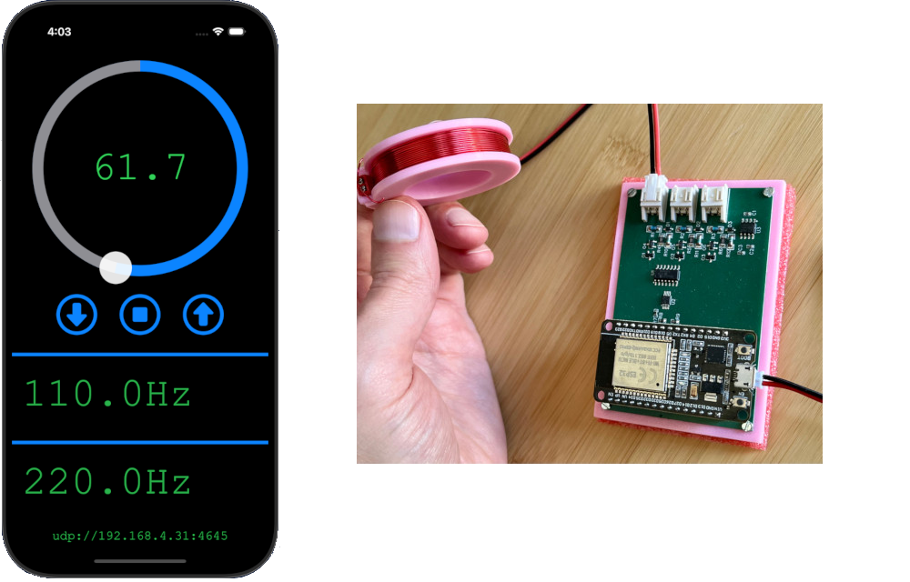
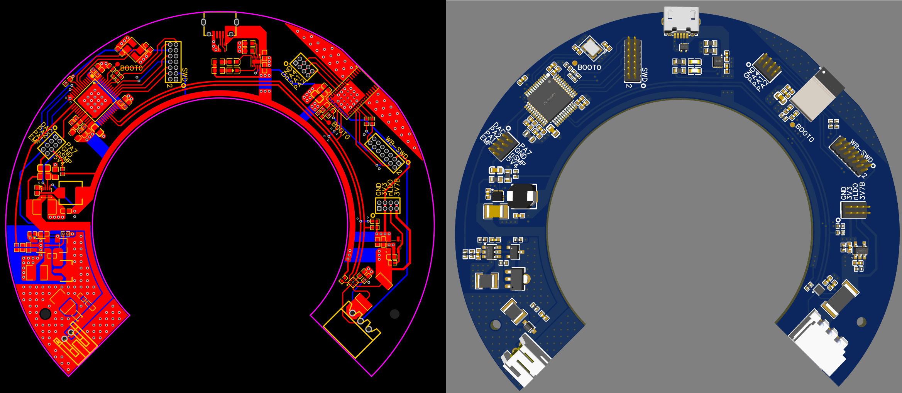
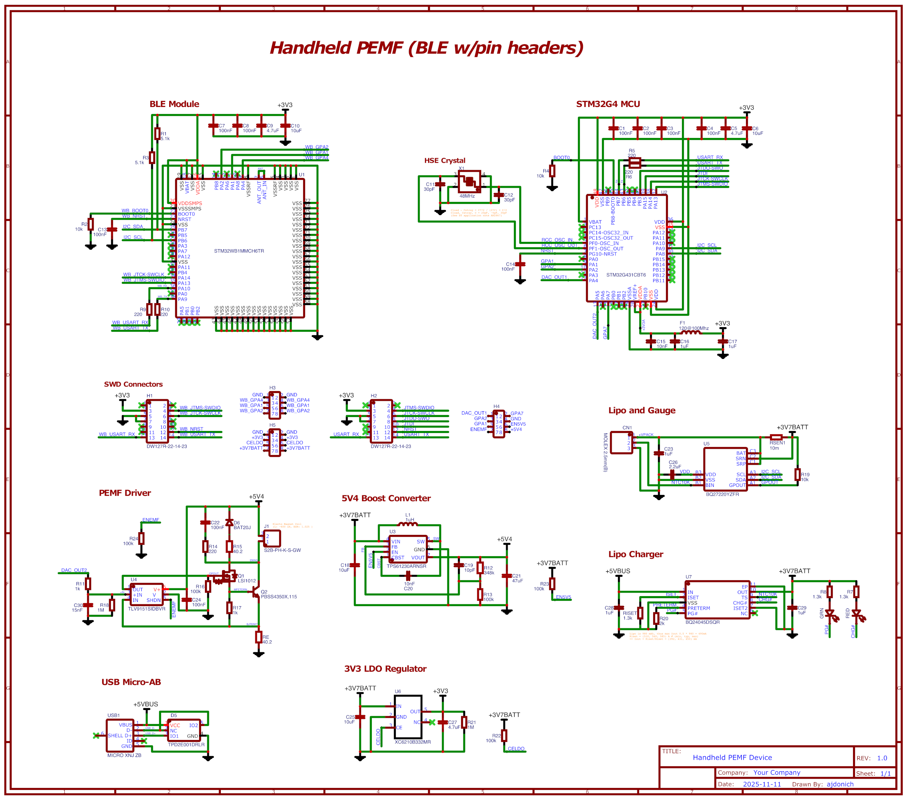

# Project Overview (PEMF Prototype Device)

The goal of this project was to design and develop a handheld Pulsed Electromagnetic Field (PEMF) therapy device aimed at the health and wellness market. PEMF therapy uses low amplitude, pulsed (or low frequency) magnetic fields applied to the body for therapeutic purposes. Though the modality is best known for its use in non-union bone fractures, it's been well researched over the last 50+ years and has a broad range of applications.

The project involved two major (PCB and software) iterations. The first version employed an ESP32, WIFI interface, and bench power supply. The second handheld version (see PCB below) employed onboard STMicro MCUs, BLE interface, and was powered by a single 3V7 lipo battery. Both versions were designed to be controlled via smartphone app. Several sub-iterations were developed to prototype independent parts of the system, at times in conjunction with ST's Nucleo dev boards. The electromagnets were hand-wound magnet wire on 3D-printed spools, meant to be built into the device case in the final CAD design.

## Software

Software associated with the project is housed in the following repos. Embedded repos are based on [PlatformIO](https://platformio.org/) for the initial ESP32 version and [STM32CubeIDE](https://www.st.com/en/development-tools/stm32cubeide.html) for the handheld version. Basic iPhone test apps for WIFI and BLE were developed to control the device. The jupyter notebooks stored in this repo were written to help model electromagnet parameters and configure and test hardware.

#### Embedded repos:
+ [PEMF-ESP32](https://github.com/ajdonich/pemf-esp32) : embedded software for the ESP32 (v1)
+ [PEMF-G431-MCU](https://github.com/ajdonich/nucleo-g431kb-dacops) : embedded software for the STM32G431 MCU (v2)
+ [PEMF-BLE-MODULE](https://github.com/ajdonich/pemf-bluetooth) : embedded software for the STM32WB1MMC BLE Module (v2)

#### Mobile repos:
+ [EMController](https://github.com/ajdonich/EMController) : WIFI interfaced iPhone app (Swift Xcode project) 
+ [BEMController](https://github.com/ajdonich/BEMController) : BLE interfaced iPhone app (Swift Xcode project)

## Mobile test app interface

The test app UI employs a circular slider to set the device electromagnet frequency. The ESP32 driven board (below) supports up to three electromagnets driven simultaneously at unique frequencies:

## PCB Design 

The final handheld design included BLE, I2C, and GPIO comms, a voltage controlled current driver circuit for the electromagnet with special consideration given to heat dissipation, micro-USB lipo charger and fuel gauge ICs, and multiple power rails sourced from the battery: one LDO regulated 3V3 rail for MCUs, and one synchronous boost converter 5V4 rail for the electromagnet driver. 

